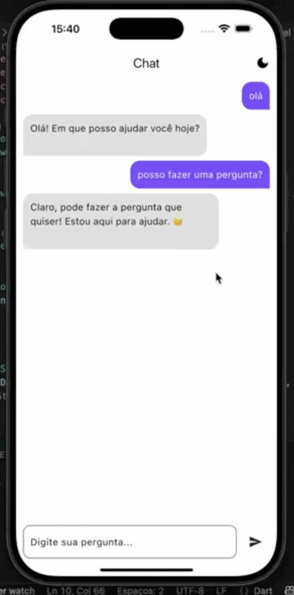

# 🤖 Project GP — AI Chat App

**Project GP** é um aplicativo de chat desenvolvido em **Flutter**, integrado à **IA generativa do Gemini (Google AI)**, com foco em oferecer uma experiência de conversa **fluida, moderna e responsiva**.

O projeto foi criado como um estudo prático de integração com APIs de IA, arquitetura reativa e construção de interfaces que simulam conversas em tempo real, proporcionando uma experiência próxima a aplicações comerciais de chat com inteligência artificial.

---

## 📱 Demonstração

  

---

## 🚀 Funcionalidades

- Chat em tempo real com IA generativa (Gemini)  
- Suporte a **tema claro e escuro**  
- Animação de digitação simulando conversa humana  
- Interface moderna, simples e focada em usabilidade  
- Arquitetura reativa para atualização eficiente da UI  

---

## 🛠️ Tecnologias Utilizadas

- **Flutter** — desenvolvimento multiplataforma  
- **Dart** — linguagem principal  
- **BLoC** — gerenciamento de estado reativo  
- **API Gemini (Google AI)** — geração de respostas inteligentes  
- **Arquitetura MVVM** — separação de responsabilidades  
- **Animações customizadas** — simulação de digitação em tempo real  

---

## 🧠 Arquitetura

O projeto foi estruturado combinando **MVVM + BLoC**, promovendo:

- separação clara entre lógica e interface  
- maior testabilidade  
- fácil manutenção e escalabilidade  

Estrutura simplificada:

- **constants/** → temas e configurações globais
- **infra/** → integração com API do Gemini
- **models/** → modelos de dados
- **presentation/** → views e blocs
- **main.dart** → bootstrap da aplicação

---

## 🧩 Desafios Técnicos

- Gerenciamento do fluxo assíncrono de mensagens com BLoC  
- Simulação realista de digitação sem bloquear a UI  
- Tratamento de estados de loading, erro e sucesso  
- Integração segura e performática com API de IA generativa  
- Sincronização entre animações e chegada das respostas  

---

## 🎯 Objetivo do Projeto

Este projeto foi desenvolvido como um **laboratório prático de integração com IA**, arquitetura reativa e construção de experiências conversacionais modernas, reforçando boas práticas de engenharia de software e experiência do usuário.

---

## 👨‍💻 Autor

**Mizael Eduardo dos Santos**  
Flutter Developer  

LinkedIn:  
https://linkedin.com/in/mizael-santos-709aa41a4
